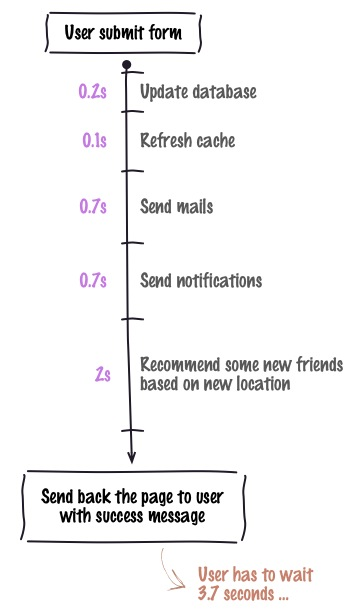
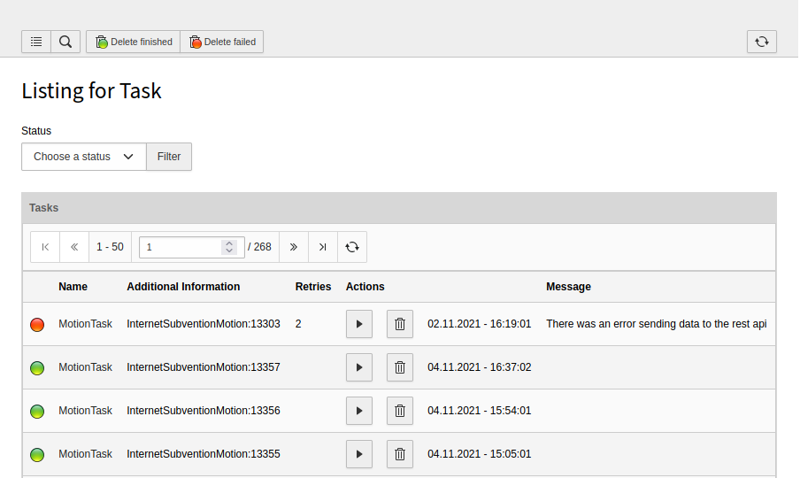

.. ==================================================
.. FOR YOUR INFORMATION
.. --------------------------------------------------
.. -*- coding: utf-8 -*- with BOM.

.. include:: ../Includes.txt

What does it do?
================
 
There are lost's of task that can be done asynchronous in an extension. 
For example: You have a user registration that sends an confirmation email and maybe renders a pdf 
which is attached to the email. The normal way would be that the user has to wait till the pdf was build and 
the email was send and then his registration is finished and he gets redirected or whatever.
But so what's is done is that the we are using the users time to run a certain task. This results in high page loading times.

   
   Default way of handling (big) tasks
   Image by http://kamisama.me/2012/10/09/background-jobs-with-php-and-resque-part-1-introduction/

A nice way of doing this would be that a task is created and stored in a queue which can later be executed (e.g. cron).

This is what this extension does. It provides a task queue for other extension where taks can be created and stored so that the 
page load speeds up. Also you have a nice overview of tasks that are in the queue which also can be manipulated.

Of course there are lots of other systems that provides such a solution, like PHPredis or PHP-Resque, but these solutions require extra 
databases or software packages. This extension does not need anything and is a small and fast solution.

   
   And this is what it looks like in the backend.
   
   
